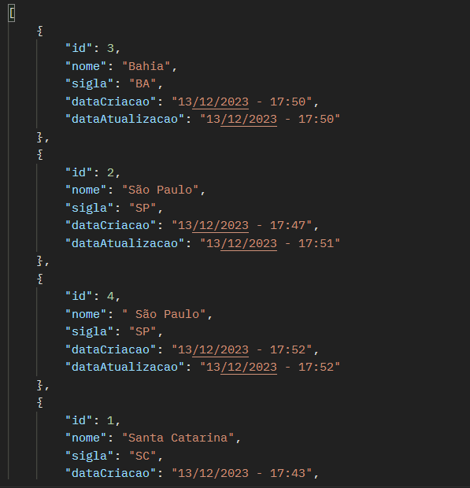

# Virtual-Store
A virtual store project that I am developing with Spring and React and Next, with this project I want to show my programming experience in the front end too

This is the registers of estados in my DataBase with correctly Times

